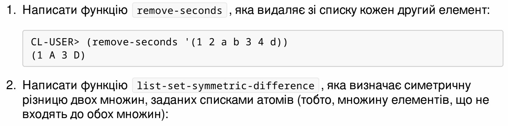
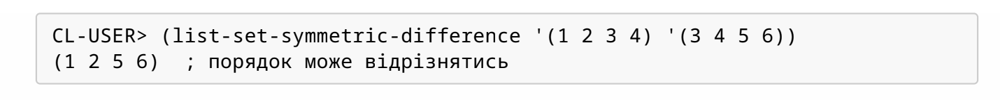

<p align="center"><b>МОНУ НТУУ КПІ ім. Ігоря Сікорського ФПМ СПіСКС</b></p>
<p align="center">
<b>Звіт з лабораторної роботи 2</b>
<p align="center">
<br>"Рекурсія"</br>
з дисципліни "Вступ до функціонального програмування"
</p>

<div style="display: flex; justify-content: flex-end;">
  <div style="border: 0px; padding: 10px;">
    <p>Студент: Чоловенко Дмитро Володимирович</p>
    <p>Група: КВ-13</p>
    <p>Рік: 2024</p>
  </div>
</div>

## Загальне завдання  
Реалізуйте дві рекурсивні функції, що виконують деякі дії з вхідним(и) списком(-ами), за можливості/необхідності використовуючи різні види рекурсії. Функції, які необхідно реалізувати, задаються варіантом (п. 2.1.1). Вимоги до функцій:

1. Зміна списку згідно із завданням має відбуватись за рахунок конструювання нового списку, а не зміни наявного (вхідного).
2. Не допускається використання функцій вищого порядку чи стандартних функцій для роботи зі списками, що не наведені в четвертому розділі навчального посібника.
3. Реалізована функція не має бути функцією вищого порядку, тобто приймати функції в якості аргументів.
4. Не допускається використання псевдофункцій (деструктивного підходу).
5. Не допускається використання циклів.

Кожна реалізована функція має бути протестована для різних тестових наборів. Тести мають бути оформленні у вигляді модульних тестів (див. п. 2.3).

Додатковий бал за лабораторну роботу можна отримати в разі виконання всіх наступних умов:
- робота виконана до дедлайну (включно з датою дедлайну)
- крім основних реалізацій функцій за варіантом, також реалізовано додатковий варіант однієї чи обох функцій, який працюватиме швидше за основну реалізацію, не порушуючи при цьому перші три вимоги до основної реалізації (вимоги 4 і 5 можуть бути порушені), за виключенням того, що в разі необхідності можна також використати стандартну функцію `copy-list`.

## Варіант №5
<p align="center">


</p>  

## Лістинг функції `remove-seconds`
``` lisp
(defun remove-seconds (lst)
  (if (or (null lst) (null (cdr lst)))
      lst  
      (cons (car lst) (remove-seconds (cddr lst)))))
```
### Тестові набори
``` lisp
(defun test-remove-seconds ()
  (print "Test funck: remove-seconds")
  (print (list "Test list 1: (1 2 a b 3 4 d) -> " (remove-seconds '(1 2 a b 3 4 d))))
  (print (list "Test list 2: (1 2 a b 3 4 d 4 d f) -> " (remove-seconds '(1 2 a b 3 4 d 4 d f))))
  (print (list "Test list 3: (1 2 a) -> " (remove-seconds '(1 2 a))))
  (print (list "Test list 4: (1) -> " (remove-seconds '(1))))
  (print (list "Test list 5: () -> " (remove-seconds '()))))
(test-remove-seconds)
```
### Тестування
```
"Test funck: remove-seconds" 
("Test list 1: (1 2 a b 3 4 d) -> " (1 A 3 D)) 
("Test list 2: (1 2 a b 3 4 d 4 d f) -> " (1 A 3 D D)) 
("Test list 3: (1 2 a) -> " (1 A)) 
("Test list 4: (1) -> " (1)) 
("Test list 5: () -> " NIL) 
```
## Лістинг функції `list-set-symmetric-difference`
```lisp
(defun list-set-symmetric-difference (lst1 lst2)
  (append (unique-elements lst1 lst2)
          (unique-elements lst2 lst1)))

(defun unique-elements (lst1 lst2)
  (cond
    ((null lst1) nil)
    ((find-element (car lst1) lst2) (unique-elements (cdr lst1) lst2))
    (t (cons (car lst1) (unique-elements (cdr lst1) lst2)))))

(defun find-element (elem lst)
  (cond
    ((null lst) nil)
    ((eql elem (car lst)) t)
    (t (find-element elem (cdr lst)))))
```
### Тестові набори
```lisp
(defun test-list-set-symmetric-difference ()
  (print "Test funck: list-set-symmetric-difference")
  (print (list "Test list 1: (1 2 3 4) and (3 4 5 6) -> "  (list-set-symmetric-difference '(1 2 3 4) '(3 4 5 6)))) 
  (print (list "Test list 2: (1 1 2 2) and (2 3 4) -> " (list-set-symmetric-difference '(1 1 2 2) '(2 3 4)))) 
  (print (list "Test list 3: (a b c) and (b c d e) -> " (list-set-symmetric-difference '(a b c) '(b c d e)))) 
  (print (list "Test list 4: (1 2 3) and () -> " (list-set-symmetric-difference '(1 2 3) '()))) 
  (print (list "Test list 5: () and (5 6 7) -> "  (list-set-symmetric-difference '() '(5 6 7)))))
(test-list-set-symmetric-difference)
```
### Тестування
```
"Test funck: list-set-symmetric-difference" 
("Test list 1: (1 2 3 4) and (3 4 5 6) -> " (1 2 5 6)) 
("Test list 2: (1 1 2 2) and (2 3 4) -> " (1 1 3 4)) 
("Test list 3: (a b c) and (b c d e) -> " (A D E)) 
("Test list 4: (1 2 3) and () -> " (1 2 3)) 
("Test list 5: () and (5 6 7) -> " (5 6 7)) 
```
